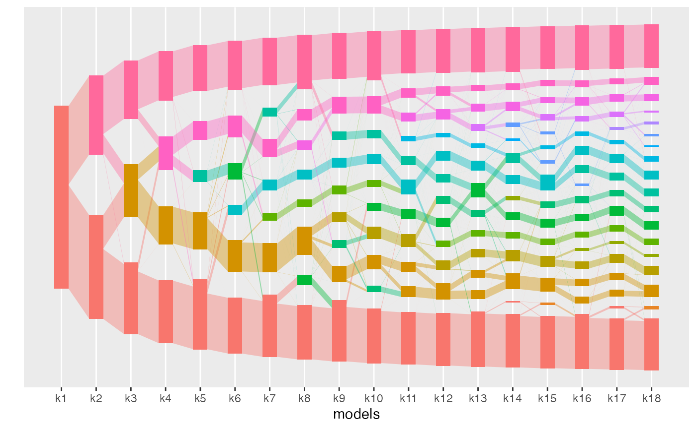

<!-- README.md is generated from README.Rmd. Please edit that file -->

# alto

<!-- badges: start -->

<!-- badges: end -->

[`alto`](https://lasy.github.io/alto/index.html) is an R package for aligning
topics across a collection of LDA models. It provides functions to support the
most common tasks in the analysis workflow,

  - `run_lda_models()` fits a collection of LDA models across resolution
    levels
  - `align_topics()` aligns topics across a collection of LDA models
  - `topics()` provides metrics of alignment quality
  - `plot()` shows the flow of alignment weight across resolution levels
  - `plot_beta()` shows the topics associated with each underlying model

Alignment can be used for (multiresolution) exploratory analysis. By
highlighting topics that are robust across choices of K, it can also
support evaluation of LDA models.

<figure>



<figcaption>

The figure above shows an example alignment between topic models. See
the vignette “Using `alto` on vaginal microbiome data” to reproduce this
figure.

</figcaption>

</figure>

## Installation

<!-- You can install the released version of alto from [CRAN](https://CRAN.R-project.org) with: -->

<!-- ``` r -->

<!-- install.packages("alto") -->

<!-- ``` -->

<!-- And  -->

You can install the development version from
[GitHub](https://github.com/) with:

``` r
# install.packages("devtools")
devtools::install_github("lasy/alto")
```

## Help

We welcome questions and comments about the package either through
[github](https://github.com/lasy/alto/issues) or email.
